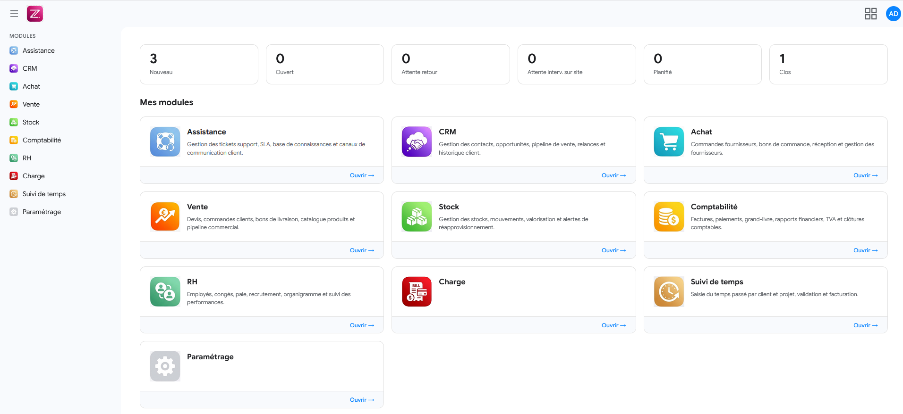

# ZELMO — ERP & CRM Open Source

> Application de gestion d'entreprise complète : comptabilité, ventes, achats, CRM, stocks, RH, ticketing et suivi du temps.

**[🌐 zelmo.fr](https://zelmo.fr)** — **[🏢 skuria.fr](https://skuria.fr)**



---

## Sommaire

1. [Fonctionnalités](#fonctionnalités)
2. [Stack technique](#stack-technique)
3. [Prérequis](#prérequis)
4. [Installation](#installation)
   - [Base de données](#1-base-de-données)
   - [Backend](#2-backend-laravel)
   - [Frontend](#3-frontend-react)
5. [Configuration multi-tenant](#configuration-multi-tenant)
6. [Premiers pas](#premiers-pas)
7. [Structure du projet](#structure-du-projet)
8. [Déploiement en production](#déploiement-en-production)

---

## Fonctionnalités

### Tableau de bord
- Vue consolidée de l'activité (ventes, paiements, tickets, temps)
- Graphiques et indicateurs clés

<!-- SCREENSHOT : Dashboard avec graphiques -->

---

### CRM — Gestion de la relation client

- **Partenaires** : fiche entreprise, coordonnées, contacts liés
- **Contacts** : personnes physiques rattachées aux partenaires
- **Appareils / Équipements** : suivi du parc matériel client
- **Opportunités** : pipeline commercial avec étapes personnalisables
- **Activités** : suivi des actions commerciales (appels, e-mails, RDV)

<!-- SCREENSHOT : Pipeline CRM -->

---

### Ventes

- **Bons de commande** : création, validation, conversion en facture
- **Factures** : facturation libre ou depuis commande, PDF, suivi des paiements
- **Contrats** : gestion des contrats récurrents avec génération automatique de factures
- **Paiements** : encaissements, affectation sur factures, multi-modes de paiement

<!-- SCREENSHOT : Liste des factures -->
<!-- SCREENSHOT : Facture détail + PDF -->

---

### Achats

- **Bons de commande fournisseur** : création, validation, réception
- Workflow d'approbation paramétrable

<!-- SCREENSHOT : Commandes achats -->

---

### Comptabilité

- **Plan comptable** : configuration du plan de comptes
- **Journal** : saisie comptable manuelle et automatique
- **Écritures comptables** : consultation, lettrage, rapprochement
- **Lettrage** : association des écritures débitrices/créditrices
- **Virements** : transferts entre comptes
- **Rapprochement bancaire** : import relevé vs écritures
- **Déclarations de TVA** : calcul et export
- **Clôtures comptables** : arrêté de période
- **Import / Export** : échanges avec d'autres outils comptables
- **Sauvegardes** : sauvegarde et restauration des données comptables
- **OCR factures** : extraction automatique des données via Veryfi

<!-- SCREENSHOT : Journal comptable -->
<!-- SCREENSHOT : Rapprochement bancaire -->

---

### Stocks

- **Produits** : catalogue, prix, références
- **Mouvements de stock** : entrées, sorties, ajustements
- **Inventaires** : comptage et valorisation
- **Bons de livraison** : expéditions clients, réceptions fournisseurs
- **Entrepôts** : gestion multi-sites

<!-- SCREENSHOT : Gestion des stocks -->

---

### RH & Notes de frais

- **Notes de frais** : création, soumission, validation
- **Kilométrage** : suivi des déplacements avec barème
- Workflow de validation multi-niveaux

<!-- SCREENSHOT : Notes de frais -->

---

### Suivi du temps

- **Saisie quotidienne / hebdomadaire** : vue calendrier et tableau
- **Projets** : organisation du temps par projet et tâche
- **Approbations** : validation des temps par les responsables
- **Rapports** : export et synthèse par période, projet, collaborateur

<!-- SCREENSHOT : Feuille de temps hebdomadaire -->

---

### Assistance & Ticketing

- **Tickets** : création, assignation, suivi de statut
- **Articles** : base de connaissance et modèles de réponse
- **Catégories** : organisation des tickets par domaine
- Liaison entre tickets (fusion, doublon, dépendance)

<!-- SCREENSHOT : Liste des tickets -->

---

### Paramètres & Administration

- **Utilisateurs** : création, rôles, permissions granulaires (Spatie)
- **Taxes** : configuration des taux de TVA
- **Modes de paiement** : espèces, virement, chèque, CB, etc.
- **Modèles d'e-mail** : templates avec variables dynamiques
- **Séquences** : numérotation automatique des documents
- **Configuration entreprise** : informations légales, logo, coordonnées
- **Entrepôts** : gestion des sites logistiques

---

## Stack technique

| Couche | Technologie | Version |
|--------|-------------|---------|
| Frontend framework | React | 19 |
| UI Components | Ant Design | 6 |
| Data fetching | TanStack React Query | 5 |
| Routing | React Router | 7 |
| Build tool | Vite | 7 |
| Éditeur riche | TinyMCE | 8 |
| Graphiques | Ant Design Charts | 2 |
| PDF client | React PDF Renderer | 4 |
| Backend framework | Laravel | 12 |
| Langage backend | PHP | 8.2+ |
| Authentification API | Laravel Sanctum | 4 |
| Permissions RBAC | Spatie Laravel Permission | 6 |
| Base de données | MariaDB | 11.4+ / MySQL 8.0+ |
| Email | PHPMailer + IMAP | — |
| PDF serveur | TCPDF | 6 |
| OCR factures | Veryfi SDK | — |

---

## Prérequis

### Serveur / Poste de développement

| Outil | Version minimale |
|-------|-----------------|
| PHP | 8.2 |
| Composer | 2.x |
| Node.js | 18+ |
| npm | 9+ |
| MariaDB / MySQL | 11.4 / 8.0 |

### Extensions PHP requises

```
pdo_mysql, mbstring, openssl, tokenizer, xml, ctype, json, bcmath, fileinfo, intl
```

---

## Installation

### 1. Base de données

```bash
# Créer la base de données
mysql -u root -p -e "CREATE DATABASE zelmo CHARACTER SET utf8mb4 COLLATE utf8mb4_unicode_ci;"

# Importer le schéma (tables, index, contraintes)
mysql -u root -p zelmo < database/schema.sql

# Initialiser les données de référence (rôles, permissions, config)
mysql -u root -p zelmo < database/initialize_db.sql

# (Optionnel) Données de démonstration
mysql -u root -p zelmo < database/demo-data.sql
```

> Voir [database/README.md](database/README.md) pour plus de détails.

---

### 2. Backend (Laravel)

```bash
cd backend

# Installer les dépendances PHP
composer install

# Configurer les tenants (voir section dédiée)
cp config/tenants.example.php config/tenants.php
# → Éditer config/tenants.php avec vos paramètres (DB, URL, clé)

# Générer la clé applicative (copier la valeur dans tenants.php)
php artisan key:generate --show

# Lier le storage public
php artisan storage:link

# Lancer le serveur de développement
php artisan serve --host=zelmo.local --port=8000
```

> ⚠️ Le fichier `config/tenants.php` contient des secrets — il est exclu du dépôt git.

---

### 3. Frontend (React)

```bash
cd frontend

# Installer les dépendances Node
npm install

# Configurer les variables d'environnement
cp .env.example .env
# → Éditer .env : VITE_API_BASE_URL=http://zelmo.local/api

# Lancer le serveur de développement
npm run dev

# Construire pour la production
npm run build
```

---

## Configuration multi-tenant

ZELMO supporte le **multi-tenant par domaine** : une même installation peut servir plusieurs clients, chacun avec sa propre base de données, son storage et ses paramètres.

La configuration est centralisée dans `backend/config/tenants.php` (exclu du git). Chaque entrée correspond à un nom de domaine HTTP :

```php
return [
    'zelmo.local' => [
        'app_key'      => 'base64:VOTRE_CLE',
        'app_url'      => 'http://zelmo.local',
        'app_name'     => 'ZELMO',
        'app_env'      => 'local',
        'app_debug'    => true,
        'frontend_url' => 'http://zelmo.local:5173',
        'database' => [
            'connection' => 'mariadb',
            'host'       => '127.0.0.1',
            'port'       => '3306',
            'database'   => 'zelmo',
            'username'   => 'root',
            'password'   => '',
        ],
        'storage_path' => 'tenants/zelmo',
        'session' => [
            'driver'   => 'database',
            'lifetime' => 120,
            'cookie'   => 'zelmo_session',
        ],
        'sanctum' => [
            'stateful_domains' => ['zelmo.local', 'zelmo.local:5173'],
        ],
    ],
];
```

Pour ajouter un second tenant, ajouter une nouvelle entrée avec un domaine différent.

> Documentation complète : [docs/MULTI-TENANT-CONFIG.md](docs/MULTI-TENANT-CONFIG.md)

---

## Premiers pas

Après installation, connectez-vous avec le compte administrateur par défaut :

| Champ | Valeur |
|-------|--------|
| Email | *(défini dans initialize_db.sql)* |
| Mot de passe | *(défini dans initialize_db.sql)* |

> Pensez à changer le mot de passe administrateur dès la première connexion.

**Étapes recommandées :**

1. **Paramètres → Entreprise** : renseigner les informations légales et le logo
2. **Paramètres → Utilisateurs** : créer les comptes collaborateurs et affecter les rôles
3. **Paramètres → Taxes** : vérifier les taux de TVA
4. **Paramètres → Modes de paiement** : configurer les modes utilisés
5. **CRM → Partenaires** : importer ou créer les premiers clients/fournisseurs
6. **Comptabilité → Plan comptable** : adapter le plan de comptes si nécessaire

---

## Structure du projet

```
zelmo/
├── backend/                    # API Laravel 12
│   ├── app/
│   │   ├── Http/Controllers/   # 60+ contrôleurs API
│   │   ├── Models/             # 96 modèles Eloquent
│   │   ├── Services/           # Logique métier
│   │   ├── Traits/             # Comportements partagés (ex: HasGridFilters)
│   │   └── Policies/           # Autorisation par ressource
│   ├── config/
│   │   ├── tenants.example.php # Modèle de configuration (à copier)
│   │   └── tenants.php         # Configuration active (exclu du git ⚠️)
│   ├── database/
│   │   ├── migrations/         # Migrations Laravel
│   │   └── seeders/            # Seeders
│   └── routes/
│       ├── api.php             # Routes API principales
│       ├── apiExpense.php      # Routes notes de frais
│       └── apiPartners.php     # Routes CRM
│
├── frontend/                   # Application React 19
│   ├── src/
│   │   ├── pages/              # Pages (accounting, crm, sales, hr, …)
│   │   ├── components/         # Composants réutilisables
│   │   ├── services/           # Clients API (axios)
│   │   ├── hooks/              # Hooks personnalisés
│   │   ├── contexts/           # React Context (auth)
│   │   └── utils/              # Utilitaires
│   └── .env.example            # Variables d'environnement (modèle)
│
├── database/                   # Scripts SQL
│   ├── schema.sql              # Schéma complet (92 tables)
│   ├── initialize_db.sql       # Données de référence initiales
│   ├── demo-data.sql           # Données de démonstration
│   └── generate_initialize_db.sh  # Script de génération de initialize_db.sql
│
├── docs/                       # Documentation technique
│   └── MULTI-TENANT-CONFIG.md  # Guide multi-tenant
│
├── .gitignore
└── README.md
```

---

## Déploiement en production

### Recommandations serveur

- **OS** : Linux (Debian/Ubuntu recommandé)
- **Serveur web** : Nginx ou Apache avec mod_rewrite
- **PHP-FPM** : PHP 8.2+
- **Base de données** : MariaDB 11.4+ ou MySQL 8.0+
- **HTTPS** : certificat SSL obligatoire (Let's Encrypt)

### Backend

```bash
cd backend
composer install --no-dev --optimize-autoloader
php artisan config:cache
php artisan route:cache
php artisan view:cache
php artisan storage:link
```

Configuration Nginx minimale (backend) :

```nginx
server {
    listen 443 ssl;
    server_name api.zelmo.com;
    root /var/www/zelmo/backend/public;

    add_header X-Frame-Options "SAMEORIGIN";
    add_header X-Content-Type-Options "nosniff";

    index index.php;

    location / {
        try_files $uri $uri/ /index.php?$query_string;
    }

    location ~ \.php$ {
        fastcgi_pass unix:/var/run/php/php8.2-fpm.sock;
        fastcgi_param SCRIPT_FILENAME $realpath_root$fastcgi_script_name;
        include fastcgi_params;
    }
}
```

### Frontend

```bash
cd frontend
npm ci
npm run build
# Le dossier dist/ est à déployer sur le serveur web
```

---

## Licence

Ce projet est distribué sous licence **MIT**. Voir le fichier [LICENSE](LICENSE) pour plus d'informations.

---

*ZELMO — Développé avec Laravel & React.*
